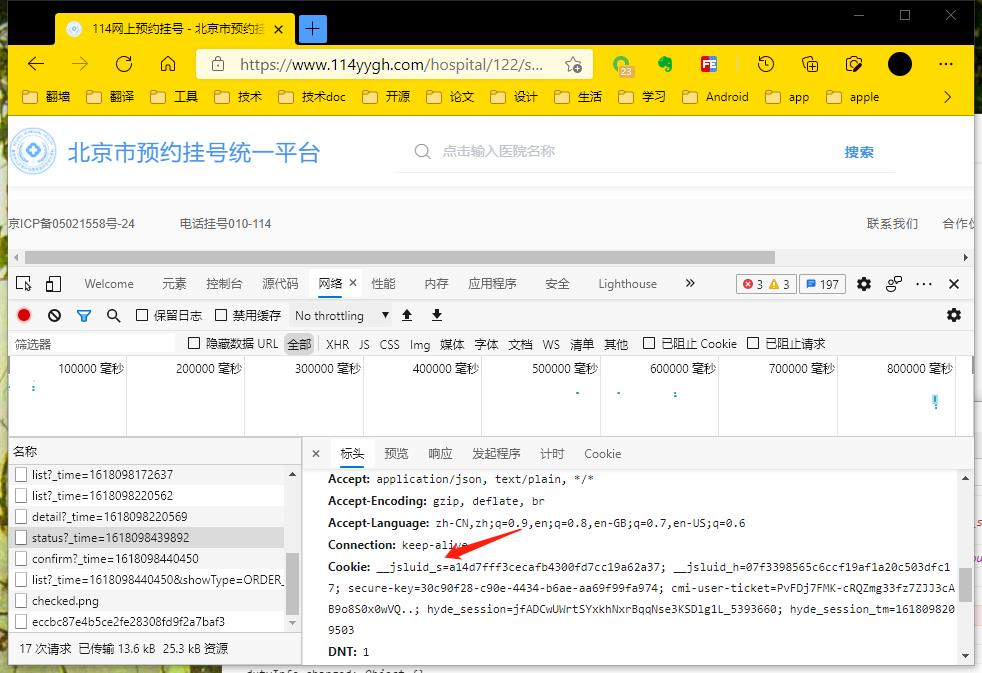

# 114guahao
114刷号
114平台挂号特别慢 尤其是放好点
因此想做一个刷好的 简化流程 提高挂号成功率

项目在16年完成 当时主要给自己和家人用 放好后 只需要把手机验证码输入 就可以直接挂号成功

成功率基本100%

当前把项目提交出来  看114网站已经调整 域名修改了 因此代码当前可能不work 后续进行改进

## 使用
* nwjs目录为node webkit 文件太大不能完全上传 可以去https://nwjs.io/下载
* luanchNW.bat window上运行
* luanch.sh mac上运行
 

患者信息 以及114网站的cookie 需要手动从网站拉取 --- 可以优化成自动的

由于当前114网站改变后 使用微信或者手机号登陆，当前自动登陆未开发， 所以需要在网站登陆后 网站请求中的cookie拷贝到工具中，只要登陆成功 随便一个请求里面都带了cookie
